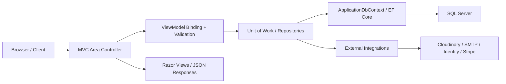

# Smart Store

Smart Store is a full-stack ASP.NET Core MVC e-commerce graduation project built around a real multi-area commerce workflow:

- `Admin` area for operational control
- `Customer` area for shopping and ordering
- `Identity` area for authentication, profile, and addresses

The project combines catalog management, stock-aware variants, carts, wishlists, coupons, order placement, shipment/payment tracking, review moderation, localization, media upload, and responsive dashboards in one codebase.

## Why This Project Stands Out

- Built on `.NET 10` with a clear MVC + Areas architecture
- Rich admin panel covering the full commerce lifecycle
- Customer shopping flow with cart, wishlist, checkout, orders, and reviews
- Stock-aware product variants with active/inactive state handling
- Stripe sandbox checkout support plus Cash on Delivery
- Cloudinary image upload for product and profile media
- ASP.NET Core Identity with profile, password, and address management
- AR / EN localization support
- Responsive UI with mobile-friendly customer and admin experiences
- Repository + Unit of Work pattern for structured data access

## Core Features

### 1. Admin Dashboard

The admin side is not just CRUD screens. It is designed as an operational control center.

Implemented admin modules:

- Dashboard analytics
  - revenue snapshot
  - order counts
  - customer counts
  - top products
  - recent orders
- Category management
- Product management
- Product variants management
- Product image galleries
- Order management
- Shipment management
- Payment tracking
- Discounts and coupon management
- Review moderation
- Customer account management

### 2. Customer Storefront

The customer side already covers the main shopping flow in a real MVC pattern.

Implemented customer modules:

- Home page with featured and latest product sections
- Product browsing
- Product details with:
  - image gallery / slider
  - variant selection
  - stock-aware size/color behavior
  - review section
- Wishlist
  - add/remove
  - move to cart
- Shopping cart
  - quantity updates
  - subtotal updates
  - coupon application
- Checkout
  - saved addresses
  - add new address inline
  - payment method selection
- Order placement
  - Cash on Delivery
  - Stripe sandbox checkout flow
- Customer order history
- Order details
- Order cancellation
- Review submission after purchase rules

### 3. Identity & User Account

Implemented account features:

- Register / Login / Logout
- Access denied flow
- Forgot password / Reset password
- Email confirmation / resend confirmation
- Google and Facebook authentication hooks
- Profile editing
  - full name
  - phone number
  - country code + local number handling
  - profile photo upload and crop
- Address management
  - add
  - edit
  - delete
  - set default
- Change password

### 4. Commerce Domain Logic

The project models real commerce relationships, not flat demo data.

Current domain includes:

- `Category`
- `Product`
- `ProductVariant`
- `ProductImage`
- `ProductVariantImage`
- `Cart`
- `CartItem`
- `WishlistItem`
- `Order`
- `OrderItem`
- `Payment`
- `Shipment`
- `Discount`
- `Review`
- `Address`
- `ApplicationUser`

Important business behaviors already represented in the code:

- stock validation before cart and order actions
- price snapshot support between cart and order flow
- coupon validation rules
- payment status lifecycle
- shipment status lifecycle
- order status transitions
- review moderation and approval workflow
- role-based access separation

## Highlighted Features

### Responsive UI

The project is not desktop-only.

It includes responsive work for:

- customer navigation with mobile bottom nav
- profile pages with mobile dropdown-style navigation
- admin dashboard with mobile dropdown navigation
- mobile card layouts for customer and admin tables

### Localization

The app supports:

- English: `en-US`
- Arabic: `ar-EG`

Culture is persisted through the request localization cookie flow.

### Media Handling

Cloudinary is integrated for:

- product images
- profile images

The profile page also supports image cropping before saving.

### Payments

Stripe is integrated in sandbox/test mode for checkout experimentation.

Supported payment paths:

- Cash on Delivery
- Credit Card via Stripe sandbox flow

### Notifications & UX Feedback

The UI includes modern feedback patterns such as:

- inline toasts
- modal confirmations
- cart count badges
- stock indicators
- status badges across admin/customer pages

## Tech Stack

- Backend: ASP.NET Core MVC on `.NET 10`
- Authentication: ASP.NET Core Identity
- ORM: Entity Framework Core 10
- Database: SQL Server
- Architecture:
  - Areas
  - Controllers
  - ViewModels
  - Repositories
  - Unit of Work
- Media: Cloudinary
- Email: MailKit SMTP
- Payments: Stripe.net
- Frontend:
  - Razor Views
  - Tailwind-based utility styling
  - Material Symbols
- Localization: ASP.NET Core Localization

## Architecture Overview

The codebase follows a classic server-rendered MVC approach with structured separation between presentation, data access, and integrations.



## Solution Structure

```text
ECommerce_System/
├── ECommerce_System/
│   ├── Areas/
│   │   ├── Admin/
│   │   ├── Customer/
│   │   └── Identity/
│   ├── Data/
│   ├── Models/
│   ├── Repositories/
│   ├── Resources/
│   ├── Utilities/
│   ├── ViewModels/
│   ├── Views/
│   └── wwwroot/
├── ECommerce_System.slnx
└── README.md
```

### Area Breakdown

- `Admin`
  - dashboard
  - products
  - categories
  - orders
  - shipments
  - payments
  - discounts
  - reviews
  - users

- `Customer`
  - home
  - products
  - cart
  - wishlist
  - checkout
  - orders
  - review submission

- `Identity`
  - account lifecycle
  - profile
  - addresses
  - password management

## Setup Guide

### 1. Prerequisites

- .NET 10 SDK
- SQL Server / LocalDB
- Visual Studio 2022 or any .NET-compatible IDE

### 2. Configure App Settings

Update `ECommerce_System/appsettings.json` for your local environment:

- `ConnectionStrings:DefaultConnection`
- `EmailSettings`
- `Cloudinary`
- `Stripe`
- `Authentication:Google`
- `Authentication:Facebook`

Recommended:

- use User Secrets for local development
- do not commit real secrets

The project already has a `UserSecretsId` configured in the `.csproj`.

### 3. Restore Dependencies

```powershell
dotnet restore
```

### 4. Build the Project

```powershell
dotnet build ECommerce_System.slnx
```

### 5. Run the Application

```powershell
dotnet run --project ECommerce_System/ECommerce_System.csproj
```

### 6. Database Initialization

The app uses a startup database initializer that:

- applies pending migrations
- creates roles
- seeds the default admin account

## Default Admin Account

The seeded development admin is:

- Email: `admin@ecommerce.com`
- Password: `Admin@123456`

These values come from:

- `ECommerce_System/Utilities/SD.cs`

Change them for any shared environment.

## Configuration Notes

### Stripe

Use test/sandbox keys in:

- `Stripe:PublishableKey`
- `Stripe:SecretKey`
- `Stripe:WebhookSecret`

### Cloudinary

Configure:

- cloud name
- api key
- api secret

for product and profile image uploads.

### External Login

Optional providers:

- Google
- Facebook

If secrets are missing, the app skips provider setup gracefully.

## What Is Already Strong

- Clean area-based separation
- Full commerce-oriented domain model
- Strong admin workflow coverage
- Identity and profile management
- Variant-aware catalog structure
- Cart / wishlist / checkout flow presence
- Responsive UI work on both admin and customer sides
- Real external integrations instead of placeholders only

## Current Focus / Still Evolving

These parts are still good candidates for further polishing:

- broader automated test coverage
- stronger webhook/payment hardening for production-like scenarios
- advanced recommendation / chat modules
- more reporting depth and analytics
- further UX polishing on selected flows

## Suggested Demo Flow

If you want to showcase the project quickly:

1. Log in as admin
2. Create categories, products, variants, and images
3. Open the customer storefront
4. Add items to wishlist and cart
5. Apply a coupon
6. Place an order
7. Review it from the admin dashboard
8. Track payment / shipment / review lifecycle

## Project Identity

This project is more than a CRUD demo.

It is a multi-module commerce system that demonstrates:

- architecture
- business flow thinking
- role separation
- responsive UI design
- real integrations
- and end-to-end e-commerce domain modeling

That makes it especially suitable as a graduation or capstone project because it shows both engineering structure and product workflow depth.
